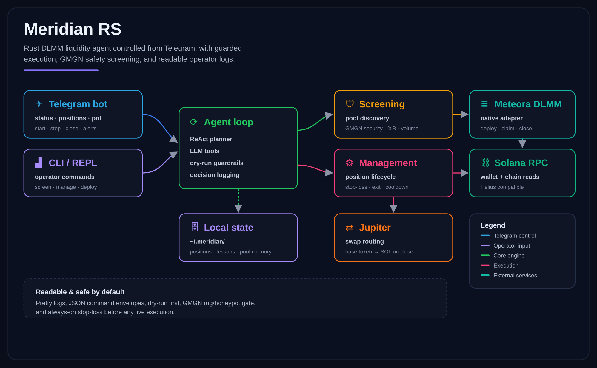
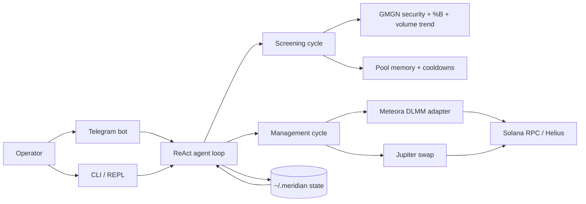

# Meridian RS



<p align="center">
  <a href="https://www.rust-lang.org/"></a>
  <a href="https://solana.com/"></a>
  
  
</p>

**Meridian RS** is a single Rust binary that runs an autonomous Meteora DLMM liquidity-provider agent on Solana. It screens memecoin pools, deploys single-sided SOL liquidity below market, manages positions through to exit, and is driven entirely from Telegram (plus a CLI / interactive REPL). One headless process — no web server, no frontend.

## What it does

| Area | Notes |
| --- | --- |
| DLMM execution | Native Rust deploy / claim / close / close+swap, single-sided SOL below market, Token-2022 support, dry-run guardrails. |
| Screening | Meteora discovery filters + GMGN token-security gate (honeypot / blacklist / mint & freeze renounce) + Bollinger %B entry gate + volume-trend gate. |
| Risk & exits | Always-on stop-loss, safety-exit on drawdown, min-duration gate, out-of-range close, and token-level repeat-loss cooldown. |
| PnL & telemetry | Realtime realized + unrealized PnL sourced from Meteora; entry-signal snapshots persisted for the Darwin signal learner. |
| Control | Telegram bot (`/status` `/positions` `/pnl` `/balance` `/candidates` `/start` `/stop` `/close`) with deploy & close alerts, plus CLI and REPL. |
| State & memory | Positions, pool memory + cooldowns, lessons, performance history, and strategy presets under `~/.meridian`. |

## Flow

1. **Screen** — each cycle the agent pulls candidate pools from Meteora discovery, applies safety + quality gates (GMGN security, %B, volume trend), and picks the highest-conviction pool.
2. **Deploy** — opens a single-sided SOL position below market across a wide bin range; entry signals are snapshotted for later learning.
3. **Manage** — each cycle re-prices open positions: cut losses (stop-loss / safety-exit), bank take-profit, and close out-of-range or low-yield positions.
4. **Close & recycle** — on close it swaps any leftover base token back to SOL and frees the slot; a repeat-losing token is cooled down so the bot stops re-entering it.
5. **Control & watch** — you drive and monitor everything from Telegram while the loop runs headless.



## Prerequisites

New to Rust or Solana? Install these first (Linux / macOS shown; on Windows use [WSL2](https://learn.microsoft.com/windows/wsl/install) and follow the same steps).

**1. Rust** — via [rustup](https://rustup.rs):

```bash
curl --proto '=https' --tlsv1.2 -sSf https://sh.rustup.rs | sh
source "$HOME/.cargo/env"          # add cargo to PATH for this shell
rustc --version                    # verify, e.g. rustc 1.85.0
```

`rustup` installs `cargo` (the build tool) into `~/.cargo/bin`. If a new terminal can't find `cargo`, add `source "$HOME/.cargo/env"` to your `~/.bashrc` / `~/.zshrc`.

**2. Solana CLI** — for creating/managing the wallet keypair:

```bash
sh -c "$(curl -sSfL https://release.anza.xyz/stable/install)"
# then add it to PATH (the installer prints the exact line):
export PATH="$HOME/.local/share/solana/install/active_release/bin:$PATH"
solana --version                   # verify
```

Add that `export PATH=...` line to your `~/.bashrc` / `~/.zshrc` so it persists across terminals.

**3. Wallet keypair** — create one (or use an existing keypair file):

```bash
solana-keygen new --outfile ~/.config/solana/meridian.json
solana-keygen pubkey ~/.config/solana/meridian.json   # your wallet address
```

Keep the **keypair file path private** — never paste the private key into config or chat. Meridian reads the wallet from `MERIDIAN_WALLET` (the public address) plus `WALLET_PRIVATE_KEY` for signing; you can point the bot at the keypair file instead of pasting the raw key. Fund this wallet with SOL before running live.

> Build tip: on Linux you may also need `build-essential`, `pkg-config`, and `libssl-dev` (`sudo apt install build-essential pkg-config libssl-dev`).

## Installation

```bash
# 1. Clone and enter the repo
git clone https://github.com/FlipZ3ro/meridian-rs.git
cd meridian-rs

# 2. Generate local config + secrets templates
cargo run -- setup --dir .

# 3. Fill wallet, RPC, LLM, Telegram, and GMGN keys. Keep DRY_RUN=true while testing.
$EDITOR .env
$EDITOR user-config.json

# 4. Build the release binary
cargo build --release

# 5. Run the agent (headless bot + Telegram control)
./target/release/meridian-rs
```

Running the binary with **no subcommand** starts the long-running agent (screening + management cycles) and the Telegram control loop. Pass a subcommand for one-shot JSON output (see [Command center](#command-center)).

For production, prefer `~/.meridian/.env`, set `MERIDIAN_DATA_DIR` / `MERIDIAN_LOCK_PATH`, and run under systemd or PM2.

### Telegram control

Create a bot with [@BotFather](https://t.me/BotFather), get your chat id (e.g. via [@userinfobot](https://t.me/userinfobot)), then set:

```dotenv
TELEGRAM_BOT_TOKEN=...
TELEGRAM_CHAT_ID=...
```

Only that one chat can command the bot. Commands:

```text
/status       agent state + open positions
/positions    open positions detail
/pnl          portfolio PnL (realized + unrealized)
/balance      wallet SOL balance
/candidates   top screening candidates
/start        resume trading (new deploys)
/stop         pause new deploys (open positions still managed)
/close <x>    close a position
/help         list commands
```

Deploy and close events are pushed to the chat automatically.

## Command center

One-shot commands print JSON and exit; run with no subcommand for the runtime.

> After `cargo build --release`, call the binary directly instead of `cargo run --`
> (which recompiles each time): `./target/release/meridian-rs status`. The examples
> below use `cargo run --` so they work before you build; both forms are equivalent.

```bash
# Runtime / setup
cargo run -- help
cargo run -- setup --dir . --force
cargo run -- status
cargo run -- screen --wallet <wallet> --wallet-sol 0
cargo run -- manage --wallet <wallet>

# Read-only views
cargo run -- balance --wallet <wallet>
cargo run -- positions --wallet <wallet>
cargo run -- pnl --pool <pool> --position <position> --wallet <wallet>
cargo run -- candidates --limit 3
cargo run -- study --pool <pool> --limit 4

# Trading actions (dry-run unless intentionally live)
cargo run -- deploy --pool <pool> --amount <sol> --bins-below 25 --bins-above 0 --strategy spot --dry-run
cargo run -- claim --position <position>
cargo run -- close --position <position> --reason "low yield" --skip-swap
cargo run -- swap --from <mint> --amount <tokens>

# State, lessons, and config
cargo run -- config get screening.timeframe
cargo run -- config set dryRun true
cargo run -- lessons list
cargo run -- performance summary
cargo run -- evolve
cargo run -- pool-memory summary
cargo run -- blacklist list
cargo run -- discord-signals
cargo run -- strategies list
```

Interactive terminal mode:

```text
status   show position state summary
screen   run the real one-shot screening cycle and print JSON
manage   run the real one-shot management cycle and print JSON
quit     graceful shutdown
```

## Readable logs

Pretty operator logs are the default. Set `MERIDIAN_LOG_STYLE=plain` if a log shipper needs the older bracketed format.

```text
2026-07-01 10:00:00  ● INFO   main      │ Meridian RS -- DLMM Liquidity Provider Agent
2026-07-01 10:00:01  ● INFO   telegram  │ interactive control online
2026-07-01 10:00:02  ● INFO   screen    │ Screening Cycle Starting
2026-07-01 10:00:03  ● INFO   executor  │ GMGN security OK — top10 0.15
```

Timestamp, level icon, level, module, message — easy to scan in a terminal and still grep-friendly.

## Project structure

```text
src/
├── main.rs              # runtime, scheduler, REPL, health, Telegram spawn
├── cli.rs               # one-shot commands and JSON envelopes
├── cycle.rs             # management, screening, and PnL polling cycles
├── config/              # config loader, env alias mapping, defaults
├── tools/               # DLMM, wallet, screening, executor, gmgn, telegram_bot
├── agent/               # ReAct loop, roles, prompt context
├── state/               # positions and pool memory
└── utils/               # logger, math, time helpers
```

## Config

Copy `user-config.example.json` → `user-config.json` and `.env.example` → `.env` (or `~/.meridian/.env` for the default runtime profile).

**Wallet** — you only need one. Point `WALLET_PRIVATE_KEY` at the Solana CLI keypair **file** you created in [Prerequisites](#prerequisites) — the raw private key never goes into config. `MERIDIAN_WALLET` (the public address) is optional and auto-derived from that keypair.

Minimum useful env:

```dotenv
DRY_RUN=true

# Path to your Solana CLI keypair file (recommended). Also accepts a raw
# base58 key or a [1,2,3,...] byte array. Use forward slashes on Windows.
WALLET_PRIVATE_KEY=/home/you/.config/solana/meridian.json
MERIDIAN_WALLET=                 # optional — auto-derived from the keypair

RPC_URL=https://api.mainnet-beta.solana.com
HELIUS_RPC_URL=
LLM_BASE_URL=https://openrouter.ai/api/v1
OPENROUTER_API_KEY=
LLM_MODEL=openai/gpt-4o-mini
TELEGRAM_BOT_TOKEN=
TELEGRAM_CHAT_ID=
GMGN_API_KEY=
MERIDIAN_LOG_STYLE=pretty
```

Supported aliases from the original project include `RPC_URL`, `HELIUS_RPC_URL`, `HELIUS_API_KEY`, `OPENROUTER_API_KEY`, `LLM_API_KEY`, `LLM_MODEL`, `MANAGEMENT_MODEL`, `SCREENING_MODEL`, `GENERAL_MODEL`, `JUPITER_API_KEY`, `GMGN_API_KEY`, `TELEGRAM_BOT_TOKEN`, and `TELEGRAM_CHAT_ID`.

Never commit real `user-config.json`, `.env`, wallet private keys, or API keys.

## Runtime state

Mutable runtime files live under `~/.meridian/` by default:

| File | Purpose |
| --- | --- |
| `meridian-state.json` | active positions and recent position events |
| `pool-memory.json` | pool notes, close history, cooldown memory |
| `discord-signals.json` | pending and processed Discord signal queue |
| `lessons.json` | lessons, performance records, and prompt memory |
| `.env` | optional global runtime env file |

Overrides:

```bash
MERIDIAN_DATA_DIR=/path/to/data
MERIDIAN_STATE_PATH=/path/to/meridian-state.json
HEALTH_PORT=8080
MERIDIAN_LOCK_PATH=/path/to/meridian.lock
```

## Docs

- [`docs/agent-meridian-relay.md`](docs/agent-meridian-relay.md): Agent Meridian / LPAgent relay replacement notes.
- [`docs/discord-signals.md`](docs/discord-signals.md): Discord signal queue and pre-check behavior.
- [`docs/pvp-risk.md`](docs/pvp-risk.md): PVP / rival-pool detection policy.
- [`docs/production-operations.md`](docs/production-operations.md): env options, systemd / PM2, startup checks, and process lock.

## License

MIT
